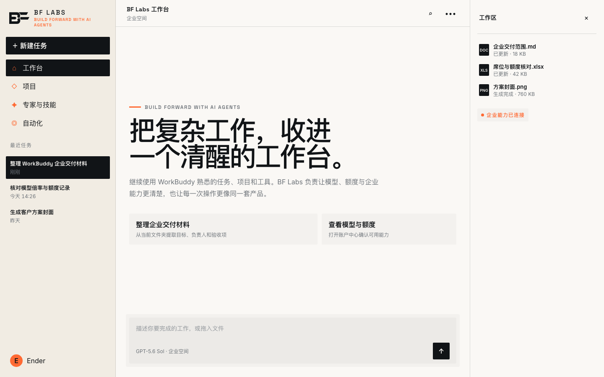

# BF Labs Studio for WorkBuddy

一套可撤销的 WorkBuddy 桌面端运行时主题。它将 BF Labs 的正式设计系统应用到 WorkBuddy，同时保留宿主的布局、控件、账号、任务和数据。

> 本项目不是腾讯官方主题 API，也不修改 WorkBuddy 安装包、`app.asar`、应用签名、账号、任务、对话或 MCP 配置。



## 设计来源

- BF Labs 品牌、token、字体、低圆角、精确标志和组件语言来自 [`Sunnyender-org/bflabs-ui`](https://github.com/Sunnyender-org/bflabs-ui)，基线提交 `f49157ff586adf91f6ba21f00f1dbbbb36e0afc5`。
- 即时反馈、空间一致性、可预测性和无障碍降级来自 [`emilkowalski/skills`](https://github.com/emilkowalski/skills) 的 `apple-design`，基线提交 `d23d7f88a2e21c9e4b1418c7abe420f5c1052ba7`。

发生冲突时，BF Labs 品牌真相优先。Apple 负责交互纪律，不替换 BF Labs 的颜色、字体角色、几何和标志。

## 当前版本

`v0.2.3`

- Windows WorkBuddy 5.3.14 已完成真实登录态首页注入、DOM/token 读回、截图、恢复和无重启热应用验证。
- macOS WorkBuddy 5.3.14 已完成相同的真实登录态首页、DOM/token、截图、恢复和热应用验证。
- 完整任务页、菜单、代码、终端和升级兼容矩阵仍是后续验证项。

完整路由矩阵通过前，`testedWorkBuddy` 保持为空；已验证表面单独记录在 `theme.json` 的 `verifiedWorkBuddy`。

## 安全边界

- 调试端口仅绑定 `127.0.0.1`，不会监听局域网。
- 注入只拥有一个 `<style>` 和两个 `body` 属性。
- 主题文件不读取账号、任务、对话、凭据、数据库或 MCP 配置。
- 恢复命令会移除本主题拥有的样式和属性。
- 第一次启用需要重启 WorkBuddy。请先保存正在运行的任务。
- 当前主题属于 WorkBuddy 会话。完整退出或升级客户端后，需要重新应用。

## 要求

- WorkBuddy 桌面端。
- Node.js 22 或更高版本。
- Windows 10/11，或 macOS 11 及更高版本。

## Windows 安装

1. 从 [Releases](https://github.com/Sunnyender-org/bflabs-workbuddy-theme/releases) 下载并解压 ZIP。
2. 保存正在运行的 WorkBuddy 任务。
3. 在解压目录打开 PowerShell：

```powershell
Set-ExecutionPolicy -Scope Process Bypass
.\scripts\apply-windows.ps1
```

如果 WorkBuddy 不在常见位置：

```powershell
.\scripts\apply-windows.ps1 -WorkBuddyPath 'D:\workbuddy\WorkBuddy.exe'
```

脚本会精确退出 `WorkBuddy.exe` 进程树，再从当前交互用户会话以本机调试参数重启。

## macOS 安装

保存正在运行的任务，然后在解压目录执行：

```bash
node scripts/runtime.mjs inspect
node scripts/runtime.mjs apply --restart-confirmed
```

默认识别 `/Applications/WorkBuddy AI.app` 和旧名称 `/Applications/WorkBuddy.app`。也可通过 `--app` 指定路径。

## 状态、验证和恢复

```bash
node scripts/runtime.mjs status
node scripts/runtime.mjs probe
node scripts/runtime.mjs screenshot --output workbuddy-theme.png
node scripts/runtime.mjs restore
```

如果希望渲染器重载后自动补回主题，可在前台运行：

```bash
node scripts/runtime.mjs apply --watch
```

不要同时运行多个守护进程。

## 开发

```bash
npm test
npm run check
npm run preview
npm run build:release
```

设计合同见 [DESIGN.md](DESIGN.md)，安全报告见 [SECURITY.md](SECURITY.md)。

## English summary

BF Labs Studio is a reversible runtime theme for Tencent WorkBuddy Desktop. It injects scoped CSS into the current Electron renderer through a loopback-only CDP endpoint. It does not modify the signed application bundle or access user data. Save active tasks before the first restart, and use `node scripts/runtime.mjs restore` to return to the native appearance.

## License

Runtime and theme code are MIT licensed. Bundled fonts use OFL 1.1, and the vendored `ws` client is MIT licensed. The BF Labs name and BF Mark remain BF Labs brand assets; see [ATTRIBUTIONS.md](ATTRIBUTIONS.md).
